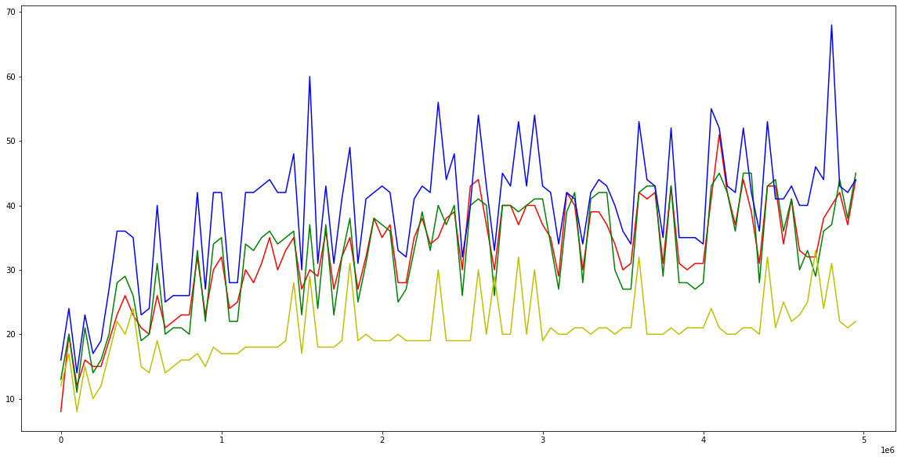
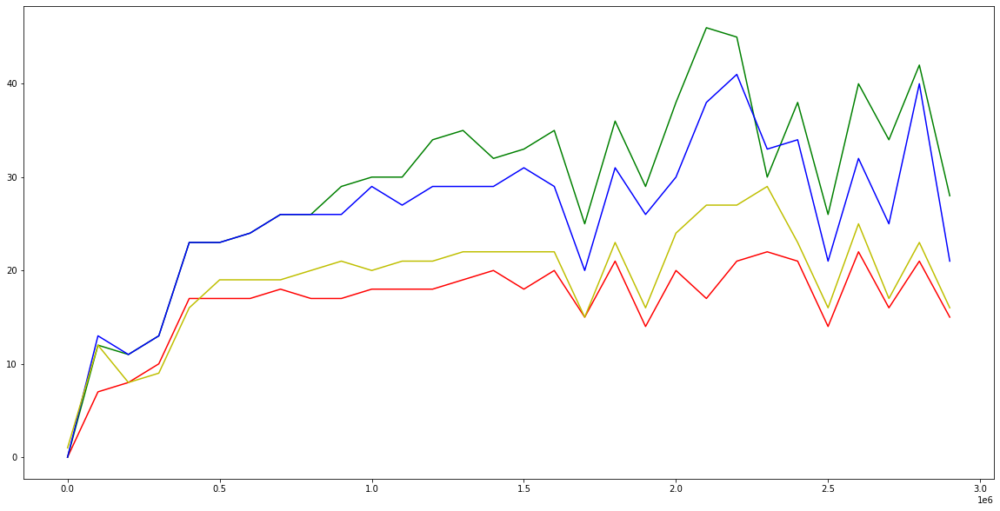
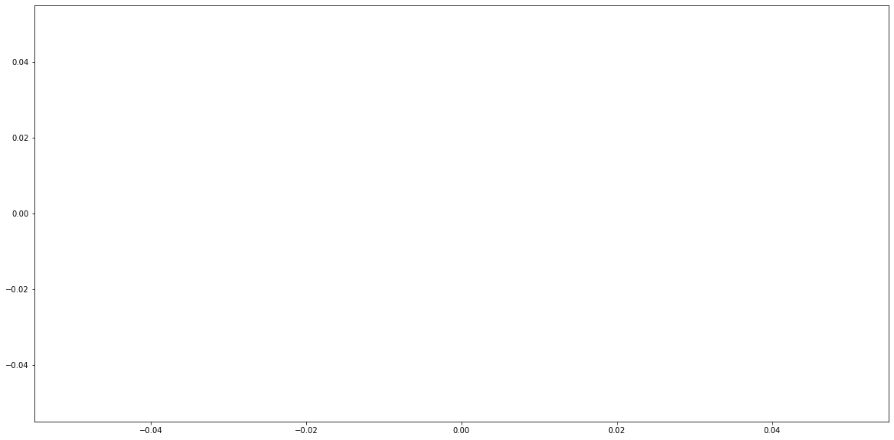

# Лабораторная работа #2
# Сравнение двоичных деревьев поиска
## Сазанов Дмитрий 18ПМИ


```python
import pandas as pd
import matplotlib.pyplot as plt
```


```python
def plot(data):
    plt.figure(figsize=(20,10))
    plt.plot(data['n'], data['avl'], 'r')
    plt.plot(data['n'], data['splay'], 'g')
    plt.plot(data['n'], data['treap'], 'b')
    plt.plot(data['n'], data['rb'], 'y')
    plt.show()
```

## Вставка
Range - от 0 до 5 млн., шаг 25 тыс. Измеряется время 10000 вставок.


```python
insert = pd.read_csv('graphs/insert.csv')
plot(insert)
```





1. Мои деревья работают медленнее, чем стандартный std::set, и график скачет, но в целом растет медленно. Видно, что основной рост происходил примерно до чуть больше миллиона, после чего все остается примерно на одном уровне. Из этого делаю вывод, что реализация работает правильно.
3. Splay и AVL вставляют примерно одинаково быстро, Treap работает медленнее всего.

## Поиск
Измеряется время за которое выполняется 10000 поисков.
Range - от 0 до 3 млн., шаг 100 тыс.


```python
search = pd.read_csv('graphs/search.csv')
plot(search)
```





1. Видно что AVL дерево ищет быстрее всего, как и должно быть - оно всегда максимально сбалансировано, следовательно на поиск нужно меньше всего времени.
2. Дальше по скорости идет RedBlack tree, реализованное в std::set.
3. Далее, с небольшим отставанием, идут Splay и Treap. Splay немного медленнее, возможно, амортизация еще не разогналась в полную силу?
4. Реализованные мной деревья показывают скорость поиска сопоставимую с деревом из стандартной библиотеки. Можно также проследить, что у графиков похожие паттерны: "пики" и "ямы" на одних точках на горизонтальной оси.

## Удаление


```python
search = pd.read_csv('graphs/remove.csv')
plot(search)
```





```python

```
